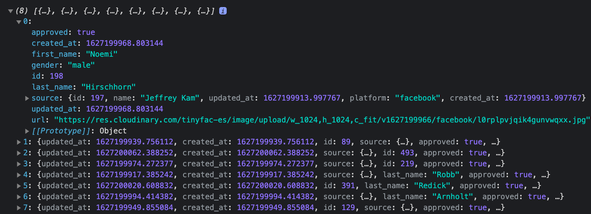

# Memory Card game

This app allow you to play memory card game.

## Demo

You can see the demo here:
 

## Installation

 
npm:

```bash
npm install
```

yarn:

```bash
yarn
```

## Deployment

To Start this project run

npm:

```bash
npm run start
```

yarn:

```bash
yarn start
```

To build the project run:

npm:

```bash
npm run build
```

yarn:

```bash
yarn build
```

## API Reference

For the api, I used tinyfac API.

#### Get TV Show details

```http
  GET https://tinyfac.es/api/data?limit=8
```

You should the response like the below image.



 
